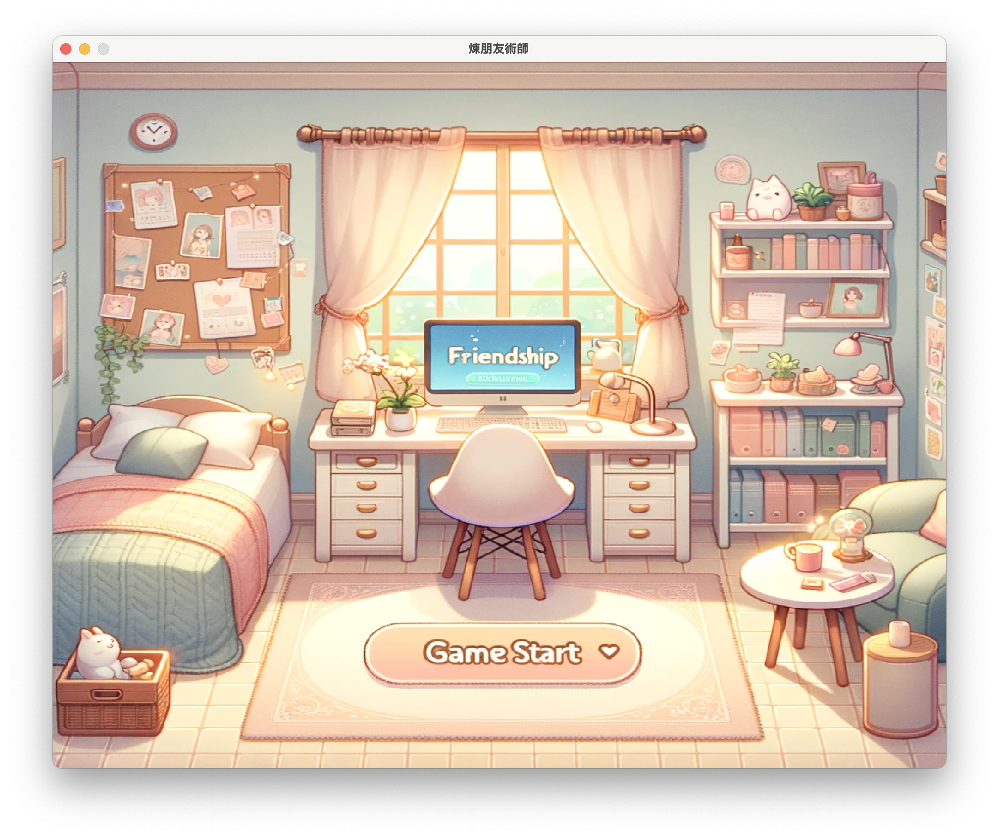
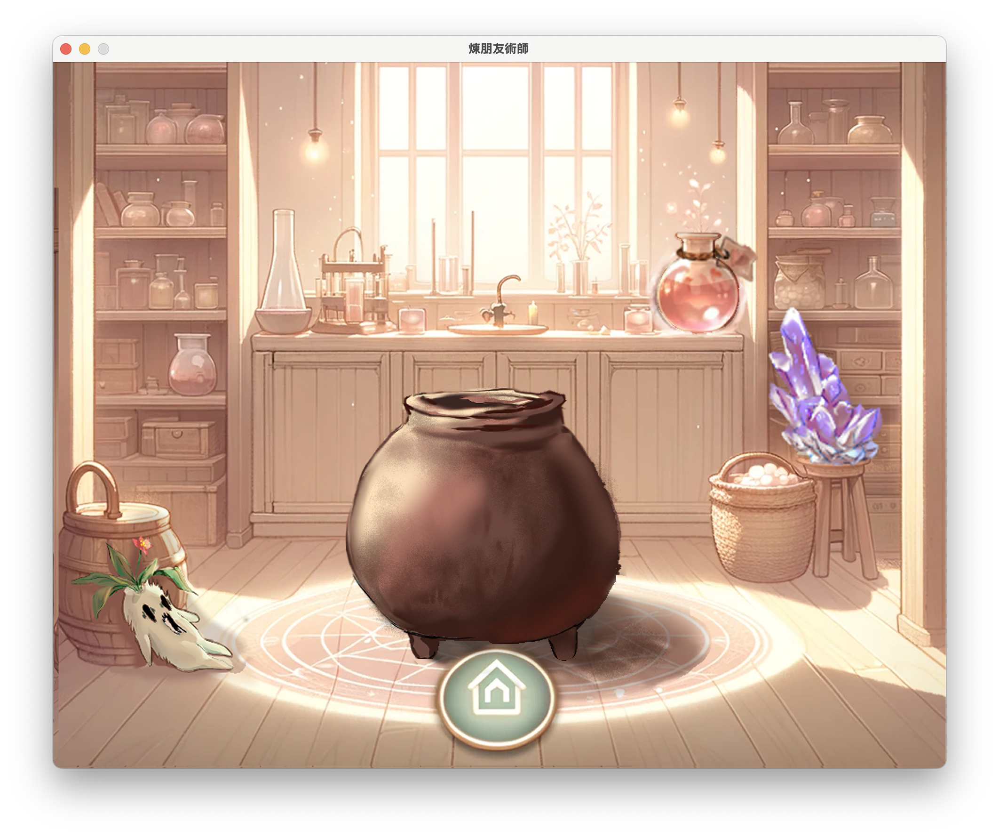
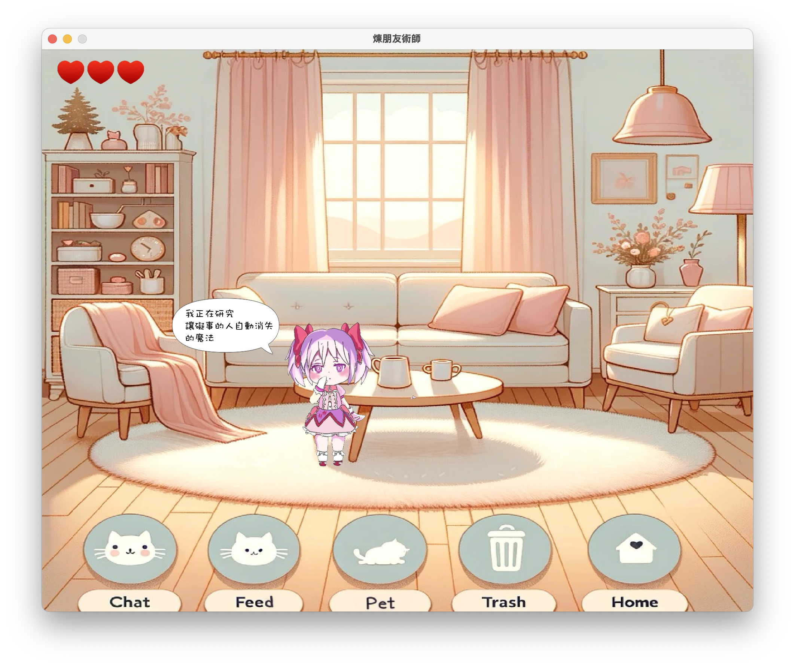
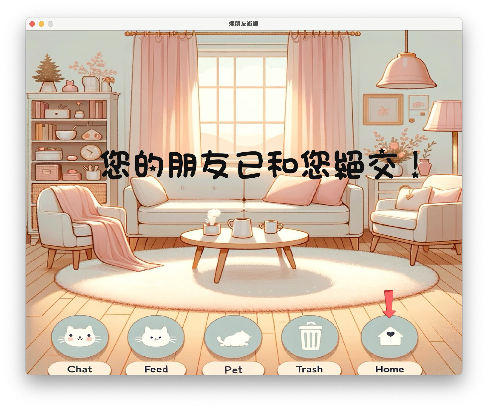

# 煉朋友術師

使用 C++ 與 Allegro 5 製作的互動式遊戲。玩家可以在煉工坊選擇材料、製作角色，並與角色進行互動。






## Overview

本專案是 Introduction to Programming 2 的期末作品，主要練習：

- C++ 程式設計
- Allegro 5 遊戲框架
- 事件驅動程式設計
- 場景切換與遊戲狀態管理
- 滑鼠輸入與互動控制
- 圖像、動畫與音效資源載入
- 角色召喚與材料組合系統
- 角色互動與動畫播放

## Game Features

玩家將在遊戲中透過選擇材料召喚不同角色，並與角色成為朋友互動，一不小心可能會被絕交！

目前可召喚的角色包括：

- 工具人
- 獸人
- 魔法少女

遊戲包含角色對話、餵食、互動動畫、魔法效果與背景音樂。

## Game Flow

1. 從主選單開始遊戲。
2. 進入工坊選擇兩種材料。
3. 根據材料組合召喚角色。
4. 進入客廳與角色互動。
5. 選擇對話、餵食或互動。
6. 觀看角色反應與動畫。
7. 返回工坊重新製作其他角色。

## Material Combinations

蘿蔔、藥水、礦石

每次最多選擇兩種材料。選擇兩種材料後，遊戲會進入召喚效果並生成對應角色。

## Controls

遊戲主要使用滑鼠操作：

| 操作 | 功能 |
| --- | --- |
| 滑鼠左鍵 | 點擊主選單、材料、畫面中按鈕 |
| 關閉視窗 | 結束遊戲 |

餐廳場景中的互動功能包括：

- 對話
- 餵食
- 撫摸
- 返回工坊

## Requirements

- macOS
- GCC
- Make
- Homebrew
- Allegro 5
- pkg-config

本專案目前的 `makefile` 使用 macOS 環境與 `pkg-config` 查找 Allegro 5 函式庫。

## Installation

### 1. 安裝 Homebrew

如果尚未安裝 Homebrew，請至官方網站取得安裝方式：

https://brew.sh/

### 2. 安裝 Allegro 5 與 pkg-config

```bash
brew install allegro pkg-config
```

確認 Allegro 已正確安裝：

```bash
pkg-config --modversion allegro-5
```

### 3. 下載專案

```bash
git clone https://github.com/Tangtang0910/I2P_allegro_game_project2.git
cd I2P_allegro_game_project2
```

## Build and Run

請在專案根目錄執行，因為遊戲會使用 `images/` 與 `sound/` 的相對路徑。

```bash
make
./game
```

也可以直接執行：

```bash
make run
```

> 如果目前的 `makefile` 尚未定義 `run` 指令，請使用 `./game` 執行遊戲。

## Clean Build Files

```bash
make clean
```

`make clean` 會移除編譯產生的 `game` 執行檔。

## Project Structure

```text
.
├── main.cpp                       # 程式入口
├── GameController.cpp             # 遊戲控制器實作
├── GameController.h               # 遊戲控制器宣告
├── global.h                       # 共用常數、列舉與 Allegro 標頭
├── makefile                       # 編譯設定
├── README.md                      # 專案說明文件
├── window/
│   ├── Window.cpp                 # 視窗基底類別實作
│   ├── Window.h                   # 視窗基底類別宣告
│   ├── Menu.cpp                   # 主選單
│   ├── Menu.h
│   ├── Workshop.cpp               # 工坊與材料選擇
│   ├── Workshop.h
│   ├── DiningRoom.cpp             # 餐廳與角色互動
│   ├── DiningRoom.h
│   ├── magic_effect.cpp           # 魔法召喚效果
│   └── magic_effect.h
├── images/
└── sound/
```

## Technical Notes

- 遊戲視窗大小設定為 `1900 × 1500`。
- 遊戲計時器 FPS 設定為 `30`。
- 遊戲透過 Allegro event queue 接收視窗、鍵盤、滑鼠與計時器事件。
- `GameController` 負責管理遊戲主迴圈、事件處理與場景切換。
- 遊戲場景由 `Menu`、`Workshop`、`DiningRoom` 與 `magic_effect` 類別負責。

使用技術：

- C++17
- Allegro 5
- Make
- GCC
- pkg-config